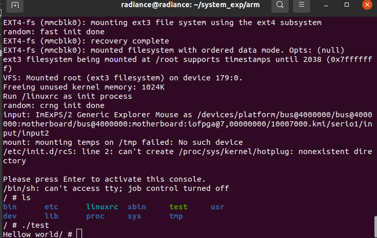
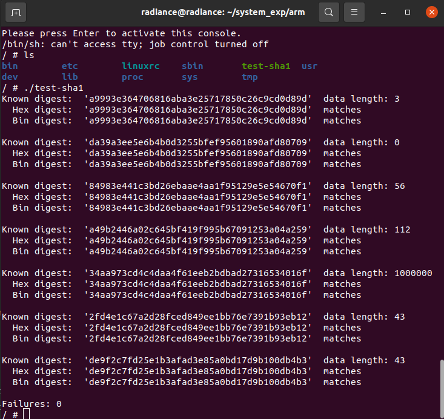
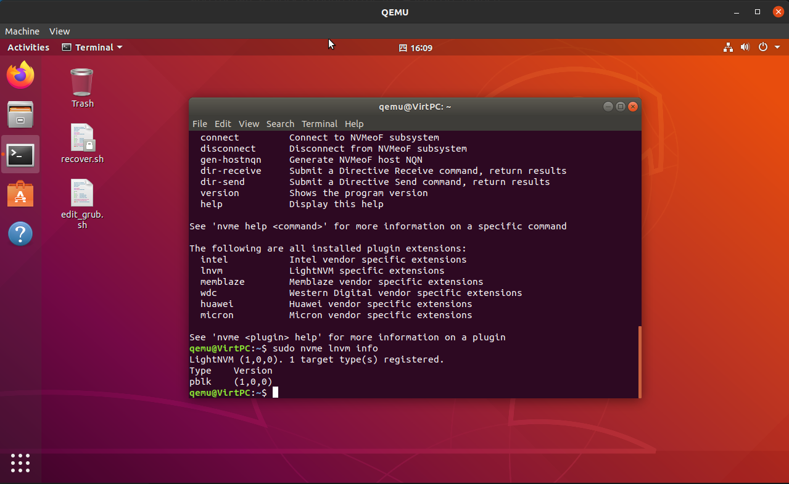

# 2022-计算机系统实验

## 面向飞腾处理器编译Linux内核和基本工具

QEMU搭建ARM LINUX开发环境:

http://www.javashuo.com/article/p-qiaglhnp-r.html#google_vignette

## 面向飞腾处理器的交叉编译环境

## SHA-1 应用程序开发

Teeny SHA-1:

https://github.com/CTrabant/teeny-sha1

## Open channel SSD 开发 (选做，完成部分)

Install qemu-nvme for Openchannel SSD2.0:

https://github.com/kekeMemory/keke.github.io/issues/1

