# 2022-计算机系统实验

## 面向飞腾处理器编译Linux内核和基本工具

### 实验目的

* 利用 QEMU 创建飞腾（ARM）架构计算机
* 在此之上编译一个基本的Linux 操作系统。

### 实验原理

* QEMU是一种纯软件实现的虚拟化模拟器，几乎能够模拟全部硬件，包括咱们本次要用的ARM A9平台。

* 它的原理是将guest架构代码转换为TCG中间代码，再转换为host架构代码。

### 实验步骤

#### 1. 安装gcc-arm-linux-gnueabi

```bash
sudo apt install gcc-arm-linux-gnueabi
```

#### 2. 安装qemu

```bash
sudo apt install qemu
```

#### 3. 下载内核及busybox源码

```bash
下载主线源码: [http://cdn.kernel.org/pub/linux/kernel/v4.x](http://www.javashuo.com/link?url=http://cdn.kernel.org/pub/linux/kernel/v4.x)
下载busybox：[https://busybox.net/downloads/busybox-1.31.1.tar.bz2](http://www.javashuo.com/link?url=https://busybox.net/downloads/busybox-1.31.1.tar.bz2)
```

#### 4. 编译busybox

```bash
make ARCH=arm CROSS_COMPILE=arm-linux-gnueabi- menuconfig
make ARCH=arm CROSS_COMPILE=arm-linux-gnueabi-
make ARCH=arm CROSS_COMPILE=arm-linux-gnueabi- install
```

至此，在busybox目录下生成了`_intall`目录,将做为咱们构建根文件系统的目录。

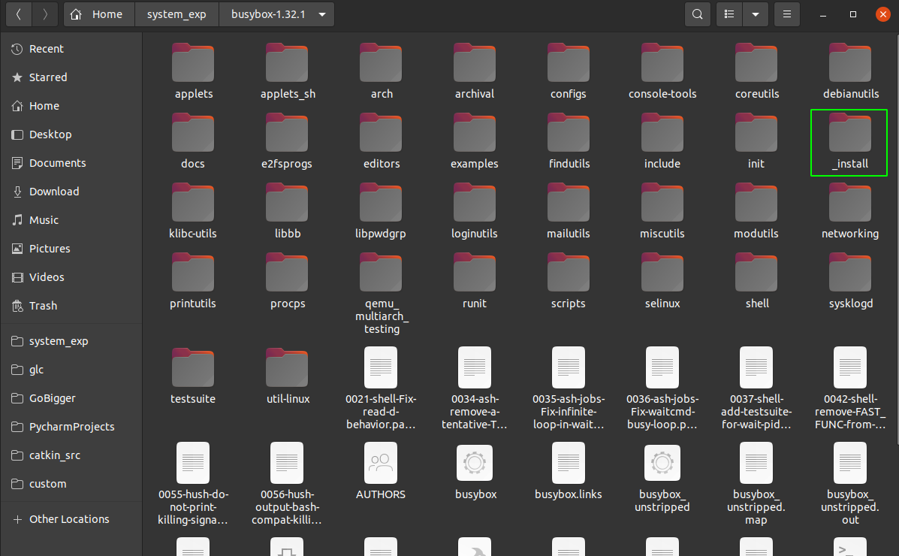

#### 5. 构建根文件系统的目录

* 在根文件系统目录下创建以下目录

```bash
mkdir etc proc sys tmp dev lib
```

* 文件系统的目录各功能

>etc ：主要存放一些配置文件如：inittab(init进程会解析此文件，看进一步动做)；fstab（主要包含一些挂载的文件系统，如sys proc） init.rd/rcS（可存放一些可执行脚本，配合inittab使用）
>
>proc : proc文件系统挂载点
>
>sys ： sys文件系统挂载点
>
>tmp ： tmp文件系统挂载点
>
>dev ： 设备文件
>
>lib ： 库文件目录（若是busybox采用动态连接库，则须要将交叉编译链的库文件拷这里）

* `dev` 目录下静态建立以下节点：

```bash
sudo mknod -m 666 tty1 c 4 1
sudo mknod -m 666 tty2 c 4 2
sudo mknod -m 666 tty3 c 4 3
sudo mknod -m 666 tty4 c 4 4
sudo mknod -m 666 console c 5 1
sudo mknod -m 666 null c 1 3
```

* `etc/inittab`文件内容以下，可参考busyboxdir/examples/inittab编写

```
::sysinit:/etc/init.d/rcS
::askfirst:/bin/sh
::ctrlaltdel:/sbin/reboot
::shutdown:/sbin/swapoff -a
::shutdown:/bin/umount -a -r
::restart:/sbin/init
tty2::askfirst:/bin/sh
tty3::askfirst:/bin/sh
tty4::askfirst:/bin/sh
```

* `etc/fstab` 文件内容以下，主要目的是指明一些文件系统挂载点：

```
#device mount-point type option dump fsck order
proc  /proc proc  defaults 0 0
temps /tmp  rpoc  defaults 0 0
none  /tmp  ramfs defaults 0 0
sysfs /sys  sysfs defaults 0 0
mdev  /dev  ramfs defaults 0 0
```

* `etc/init.d/rcS` 文件内容以下，inittab第一条指明了从rcS中去执行脚本ui

```bash
mount -a
echo "/sbin/mdev" > /proc/sys/kernel/hotplug
/sbin/mdev -s       # 根据/etc/mdev.conf中的配置进行生成设备节点
mount -a
```

顺便修改rcS的权限：

```bash
chmod 777 etc/init.d/rcS
```

lib 文件拷贝，由于busybox咱们采用默认的动态连接（建议），这样能够节省根文件系统大小，由于应用也能够连接相应的库。首先经过下边3条命令任意一条查看busybox依赖的库文件。

```bash
arm-linux-readelf -d busybox | grep NEEDED
arm--linux-objdump -x busybox | grep NEEDED
strings busybox | grep ^lib
```

注意：ld-linux.so.3有时候不会显示，咱们也必须拷贝它，若是之后编译应用程序，咱们也要查看依赖的库，补足根文件系统中缺乏的库文件。

```bash
cp /usr/arm-linux-gnueabi/lib/ld-linux.so.3 _install/lib/
cp /usr/arm-linux-gnueabi/lib/libc.so.6 _install/lib/
cp /usr/arm-linux-gnueabi/lib/libm.so.6 _install/lib/
cp /usr/arm-linux-gnueabi/lib/libresolv.so.2 _install/lib/
```

至此，树形目录结构如下

> tree:
>
> .
> ├── bin
> │   ├── ...
> ├── dev
> │   ├── console
> │   ├── null
> │   ├── tty1
> │   ├── tty2
> │   ├── tty3
> │   └── tty4
> ├── etc
> │   ├── fstab
> │   ├── init.d
> │   │   └── rcS
> │   └── inittab
> ├── lib
> │   ├── ...
> └── sbin

#### 6. 进入linux文件夹下，编译内核

```bash
make ARCH=arm CROSS_COMPILE=arm-linux-gnueabi- vexpress_defconfig
make ARCH=arm CROSS_COMPILE=arm-linux-gnueabi- menuconfig(option)
make
```

将 zImage dtb文件拷贝出来，方便使用。 若是已经咱们已经开发了一些驱动，须要进行测试，除了将ko文件拷贝到根文件系统中，也应该执行模块安装命令，不然modules依赖关系，参数、符号等没法使用。

```
make ARCH=arm CROSS_COMPILE=arm-linux-gnueabi- modules_install INSTALL_MOD_PATH=<busybox-dir>/_install/
```

执行完成后，将在根文件系统的lib下建立modules目录。

#### 7. 建立根文件系统镜像文件

使用dd命令建立一个空白的32M(根据实际状况)文件:

```bash
dd if=/dev/zero of=rootfs.ext3 bs=1M count=32
```

将该空白文件格式化为ext3格式（内核默认支持文件系统，若是使用其余须要配置内核）:

```bash
mkfs.ext3 rootfs.ext3
```

将该空白文件，挂载在一个目录下：

```bash
sudo mkdir -p /mnt/fs
sudo mount -o loop rootfs.ext3 /mnt/fs
```

将busybox构建的根文件系统拷贝到挂载点下,而后再卸载

```bash
sudo cp -rf busybox-dir/_install/* /mnt/fs
sudo umount /mnt/fs
```

#### 8. 使用qemu运行验证

整理文件至一个文件夹内

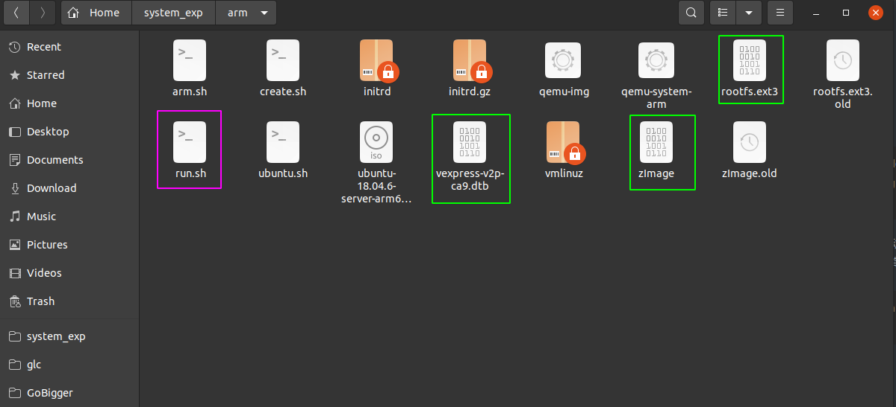

创建一个run.sh脚本，内容以下：

```bash
qemu-system-arm \
	-M vexpress-a9 \
	-kernel ./zImage \
	-nographic \
	-m 512M \
	-smp 4 \
	-sd ./rootfs.ext3 \
	-dtb vexpress-v2p-ca9.dtb \
	-append "init=/linuxrc root=/dev/mmcblk0 rw rootwait earlyprintk console=ttyAMA0"
```

> 上述脚本，-M 指定了目标板， -kernel 指定了linux内核镜像， -nographic 指定无图形显示，-m  512M指定了运行内存大小，-smp 指定4核， -sd 指定了外部有1个sd卡，卡内是rootfs.ext3镜像文件， -dtb  指定了设备树文件， -append 指定了bootargs； bootargs中init=/linuxrc  指定了init进程是根文件系统下的linuxrc（busybox生成）， root=/dev/mmcblk0 指定了根文件系统为sd卡，  console指定了ttyAMA0，即控制台。

### 实验结果

打开虚拟机进行测试

```bash
./run.sh
```

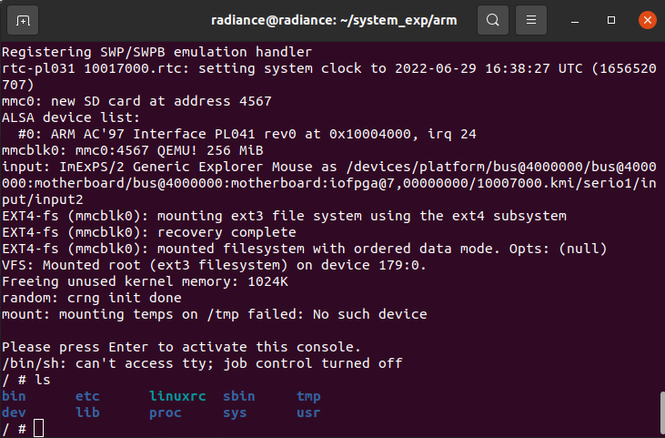

本次实验利用 qemu 创建飞腾架构计算机，在此之上编译一个基本的Linux 操作系统，通过 Busybox 构
建了基本的系统命令。

------

## 面向飞腾处理器的交叉编译环境

### 实验目的

* 利用 crosstool 制作一个交叉编译工具链，使其能交叉编译 c 源文件，生成飞腾平台下的可执行文件
  

### 实验原理

#### 交叉编译

交叉编译是在一个平台上生成另一个平台上的可执行代码。同一个体系结构可以运行不同的操作系统；同样，同一个操作系统也可以在不同的体系结构上运行。

> 如何理解build, host, target 
>
> ​      build -- 在build系统中建立package     
>
> ​      host -- 建立好package后，package能够在host运行     
>
> ​      target -- 经由package所产生的可执行文件能够在target上运行。   

#### 静态编译

静态编译就是编译器在编译可执行文件的时候,将可执行文件需要调用的对应动态链接库(.so)中的部分提取出来,链接到可执行文件中去,使可执行文件在运行的时候不依赖于动态链接库。

### 实验步骤

#### 1. 安装相关工具

```bash
sudo apt-get install autoconf automake libtool libncurses5-dev gperf texinfo
help2man gawk libtool-bin g++
```

#### 2. 进入 crosstool 源码包解压的目录里安装crosstool工具

```bash
mkdir src tools
./bootstrap
./configure
make
sudo make install
```

> 刘哥的报告里是这样写的
>
> `./configure --prefix /home/liuqingshuai/Desktop/cross/crosstool-install`
>
> 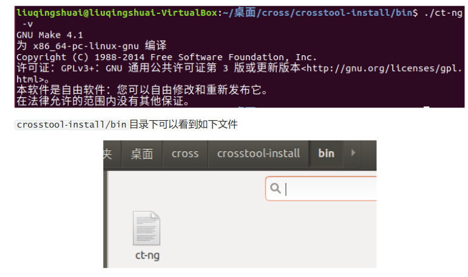
>
> `--prefix`的作用是指定安装地址，若不指定会安装在`/usr/local`下
>
> 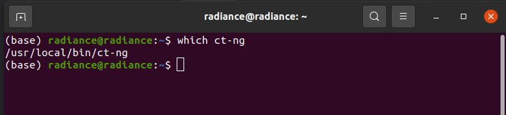

#### 3. 配置crosstool工具

```bash
ct-ng menuconfig
```

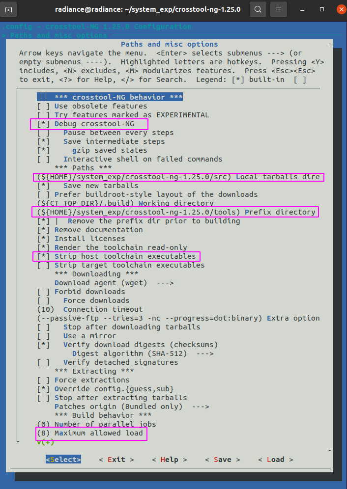

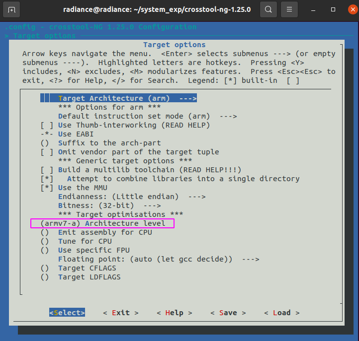

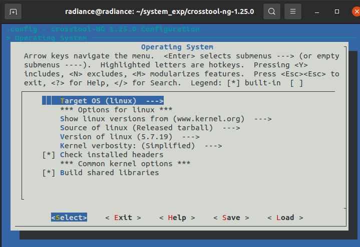

> 如果小版本不一样则需要打开.config手动搜索更改
>
> 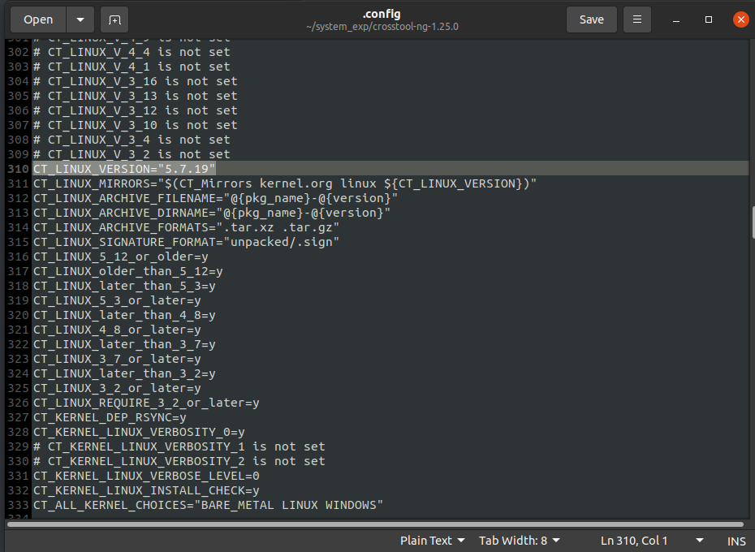

修改`GLIBC`版本

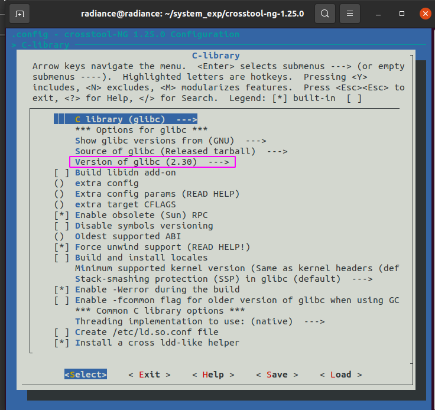

> 我第一次gcc编译成功，但编译出的东西因`GLIBC`版本太高运行不了
>
> 所以可以先查看系统`GLIBC`最高支持的版本，在config中修改使其支持
>
> 
>
> 

#### 4. ct-ng build

```bash
unset LD_LIBRARY_PATH
ct-ng build
```

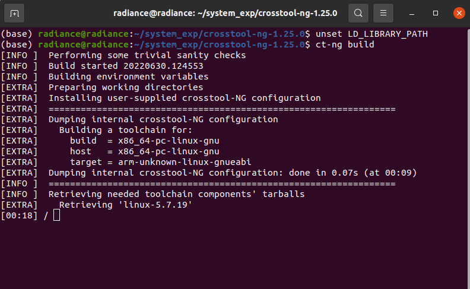


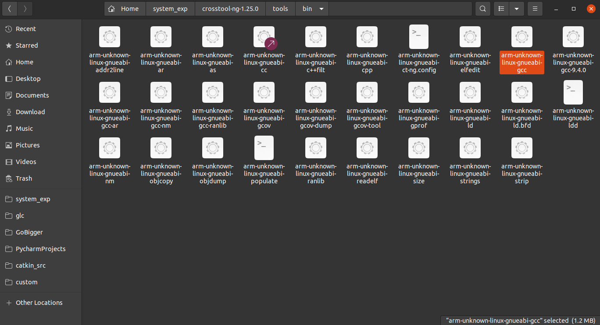

5. 创建helloworld.c并在qemu中测试

```bash
sudo /home/radiance/system_exp/crosstool-ng-1.25.0/tools/bin/arm-unknown-linux-gnueabi-gcc helloWorld.c -o test
```

```c
#include<stdio.h>
int main(){
	printf("Hellow world");
	return 0;
}
```

将该空白文件，挂载在一个目录下：

```bash
sudo mkdir -p /mnt/fs
sudo mount -o loop rootfs.ext3 /mnt/fs
```

将test拷贝到挂载点下,而后再卸载

```bash
sudo cp test /mnt/fs
sudo umount /mnt/fs
```

打开虚拟机进行测试

```bash
./run.sh
```

在打开的虚拟机中

```bash
./test
```

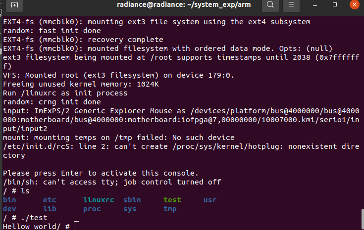

### 实验结果

成功生成了 arm 的 gcc 编译工具，并成功生成 arm 平台下可执行文件，同时在 qemu 模拟器里成功执行

## SHA-1 应用程序开发

### 实验目的

* 利用实验一编译出的操作系统和实验二构建的编译工具链，
  完成一个基于 c 语言的 SHA-1 应用程序开发。编译产生的可
  执行文件能在 qemu 中执行

* 实现简单 HTTP 服务器应用

### 实验原理

#### SHA-1简介

SHA-1 又名安全散列算法 1，可以将一个最大 2<sup>64</sup>比特的消息，转换成一串 160 位的（20 字节）散列值，散列值通常的呈现形式为 40个十六进制数。在几乎所有的情况下，两份文件只要有任何一点不相同，其经过计算得到的 SHA-1 值都是天差地别的。也就是说可以通过计算文件的 SHA-1 值，与原文件提供的 SHA-1 值来确认该文件和原文件内容是否完全一致，这比单纯比较文件的一个个字节会快很多。但是 SHA-1 也面临碰撞攻击，现阶段的一些算法已经可以经过设计，制作出两份不同内容但 SHA-1 值相同的文件。

#### 详细过程

在SHA1算法中，我们必须把原始消息（字符串，文件等）转换成位字符串。SHA1算法只接受位作为输入。假设我们对字符串“abc”产生消息摘要。首先，我们将它转换成位字符串如下：

```
01100001 01100010 01100011
―――――――――――――
‘a’=97   ‘b’=98   ‘c’=99
```

这个位字符串的长度为24。下面我们需要5个步骤来计算MD5。

**补位**

消息必须进行补位，以使其长度在对512取模以后的余数是448。也就是说，（补位后的消息长度）%512 = 448。即使长度已经满足对512取模后余数是448，补位也必须要进行。

补位是这样进行的：先补一个1，然后再补0，直到长度满足对512取模后余数是448。总而言之，补位是至少补一位，最多补512位。还是以前面的“abc”为例显示补位的过程。

    原始信息： 01100001 01100010 01100011
    
    补位第一步：01100001 01100010 01100011 1
    首先补一个“1”
    
    补位第二步：01100001 01100010 01100011 10…..0
    然后补423个“0”

我们可以把最后补位完成后的数据用16进制写成下面的样子

```
61626380 00000000 00000000 00000000
00000000 00000000 00000000 00000000
00000000 00000000 00000000 00000000
00000000 00000000
```

现在，数据的长度是448了，我们可以进行下一步操作。

**补长度**

所谓的补长度是将原始数据的长度补到已经进行了补位操作的消息后面。通常用一个64位的数据来表示原始消息的长度。如果消息长度不大于2^64，那么第一个字就是0。在进行了补长度的操作以后，整个消息就变成下面这样了（16进制格式）

    61626380 00000000 00000000 00000000
    00000000 00000000 00000000 00000000
    00000000 00000000 00000000 00000000
    00000000 00000000 00000000 00000018

如果原始的消息长度超过了512，我们需要将它补成512的倍数。然后我们把整个消息分成一个一个512位的数据块，分别处理每一个数据块，从而得到消息摘要。

**使用的常量**

一系列的常量字K(0), K(1), ... , K(79)，如果以16进制给出。它们如下：

```
Kt = 0x5A827999  (0 <= t <= 19)
Kt = 0x6ED9EBA1 (20 <= t <= 39)
Kt = 0x8F1BBCDC (40 <= t <= 59)
Kt = 0xCA62C1D6 (60 <= t <= 79).
```

**需要使用的函数**

在SHA1中我们需要一系列的函数。每个函数ft (0 <= t <= 79)都操作32位字B，C，D并且产生32位字作为输出。ft(B,C,D)可以如下定义

```
ft(B,C,D) = (B AND C) or ((NOT B) AND D) ( 0 <= t <= 19)
ft(B,C,D) = B XOR C XOR D              (20 <= t <= 39)
ft(B,C,D) = (B AND C) or (B AND D) or (C AND D) (40 <= t <= 59)
ft(B,C,D) = B XOR C XOR D                     (60 <= t <= 79).
```

**计算消息摘要**

必须使用进行了补位和补长度后的消息来计算消息摘要。计算需要两个缓冲区，每个都由5个32位的字组成，还需要一个80个32位字的缓冲区。第一个5个字的缓冲区被标识为A，B，C，D，E。第一个5个字的缓冲区被标识为H0, H1, H2, H3, H4。80个字的缓冲区被标识为W0, W1,..., W79，另外还需要一个一个字的TEMP缓冲区。为了产生消息摘要，在第4部分中定义的16个字的数据块M1, M2,..., Mn会依次进行处理，处理每个数据块Mi 包含80个步骤。

在处理每个数据块之前，缓冲区{Hi} 被初始化为下面的值（16进制）

```
H0 = 0x67452301
H1 = 0xEFCDAB89
H2 = 0x98BADCFE
H3 = 0x10325476
H4 = 0xC3D2E1F0.
```


现在开始处理M1, M2, ... , Mn。为了处理 Mi,需要进行下面的步骤

```
(1) 将 Mi 分成 16 个字 W0, W1, ... , W15,  W0 是最左边的字
(2) 对于 t = 16 到 79 令 Wt = S1(Wt-3 XOR Wt-8 XOR Wt- 14 XOR Wt-16).
(3) 令 A = H0, B = H1, C = H2, D = H3, E = H4.
(4) 对于 t = 0 到 79，执行下面的循环
	TEMP = S5(A) + ft(B,C,D) + E + Wt + Kt;
	E = D; D = C; C = S30(B); B = A; A = TEMP;
(5) 令 H0 = H0 + A, H1 = H1 + B, H2 = H2 + C, H3 = H3 + D, H4 = H4 + E.
在处理完所有的 Mn, 后，消息摘要是一个160位的字符串，以下面的顺序标识
```

### 实验步骤

SHA-1算法

```c
int sha1digest(uint8_t *digest, char *hexdigest, const uint8_t *data, size_t databytes)
{
#define SHA1ROTATELEFT(value, bits) (((value) << (bits)) | ((value) >> (32 - (bits))))

  uint32_t W[80];
  uint32_t H[] = {0x67452301,
                  0xEFCDAB89,
                  0x98BADCFE,
                  0x10325476,
                  0xC3D2E1F0};
  uint32_t a;
  uint32_t b;
  uint32_t c;
  uint32_t d;
  uint32_t e;
  uint32_t f = 0;
  uint32_t k = 0;

  uint32_t idx;
  uint32_t lidx;
  uint32_t widx;
  uint32_t didx = 0;

  int32_t wcount;
  uint32_t temp;
  uint64_t databits = ((uint64_t)databytes) * 8;
  uint32_t loopcount = (databytes + 8) / 64 + 1;
  uint32_t tailbytes = 64 * loopcount - databytes;
  uint8_t datatail[128] = {0};

  if (!digest && !hexdigest)
    return -1;

  if (!data)
    return -1;

  datatail[0] = 0x80;
  datatail[tailbytes - 8] = (uint8_t) (databits >> 56 & 0xFF);
  datatail[tailbytes - 7] = (uint8_t) (databits >> 48 & 0xFF);
  datatail[tailbytes - 6] = (uint8_t) (databits >> 40 & 0xFF);
  datatail[tailbytes - 5] = (uint8_t) (databits >> 32 & 0xFF);
  datatail[tailbytes - 4] = (uint8_t) (databits >> 24 & 0xFF);
  datatail[tailbytes - 3] = (uint8_t) (databits >> 16 & 0xFF);
  datatail[tailbytes - 2] = (uint8_t) (databits >> 8 & 0xFF);
  datatail[tailbytes - 1] = (uint8_t) (databits >> 0 & 0xFF);


  for (lidx = 0; lidx < loopcount; lidx++)
  {
    memset (W, 0, 80 * sizeof (uint32_t));

    for (widx = 0; widx <= 15; widx++)
    {
      wcount = 24;

      while (didx < databytes && wcount >= 0)
      {
        W[widx] += (((uint32_t)data[didx]) << wcount);
        didx++;
        wcount -= 8;
      }

      while (wcount >= 0)
      {
        W[widx] += (((uint32_t)datatail[didx - databytes]) << wcount);
        didx++;
        wcount -= 8;
      }
    }

    for (widx = 16; widx <= 31; widx++)
    {
      W[widx] = SHA1ROTATELEFT ((W[widx - 3] ^ W[widx - 8] ^ W[widx - 14] ^ W[widx - 16]), 1);
    }
    for (widx = 32; widx <= 79; widx++)
    {
      W[widx] = SHA1ROTATELEFT ((W[widx - 6] ^ W[widx - 16] ^ W[widx - 28] ^ W[widx - 32]), 2);
    }

    /* Main loop */
    a = H[0];
    b = H[1];
    c = H[2];
    d = H[3];
    e = H[4];

    for (idx = 0; idx <= 79; idx++)
    {
      if (idx <= 19)
      {
        f = (b & c) | ((~b) & d);
        k = 0x5A827999;
      }
      else if (idx >= 20 && idx <= 39)
      {
        f = b ^ c ^ d;
        k = 0x6ED9EBA1;
      }
      else if (idx >= 40 && idx <= 59)
      {
        f = (b & c) | (b & d) | (c & d);
        k = 0x8F1BBCDC;
      }
      else if (idx >= 60 && idx <= 79)
      {
        f = b ^ c ^ d;
        k = 0xCA62C1D6;
      }
      temp = SHA1ROTATELEFT (a, 5) + f + e + k + W[idx];
      e = d;
      d = c;
      c = SHA1ROTATELEFT (b, 30);
      b = a;
      a = temp;
    }

    H[0] += a;
    H[1] += b;
    H[2] += c;
    H[3] += d;
    H[4] += e;
  }

  /* Store binary digest in supplied buffer */
  if (digest)
  {
    for (idx = 0; idx < 5; idx++)
    {
      digest[idx * 4 + 0] = (uint8_t) (H[idx] >> 24);
      digest[idx * 4 + 1] = (uint8_t) (H[idx] >> 16);
      digest[idx * 4 + 2] = (uint8_t) (H[idx] >> 8);
      digest[idx * 4 + 3] = (uint8_t) (H[idx]);
    }
  }

  /* Store hex version of digest in supplied buffer */
  if (hexdigest)
  {
    snprintf (hexdigest, 41, "%08x%08x%08x%08x%08x",
              H[0],H[1],H[2],H[3],H[4]);
  }

  return 0;
}
```

经交叉编译后，在qemu中运行：

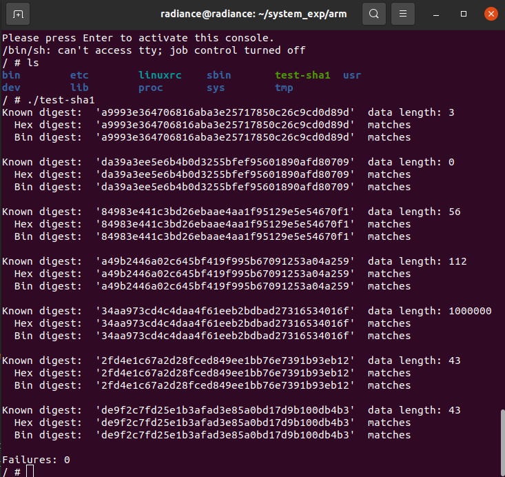

### 实验结果

成功写了一个能计算 SHA-1 的 C 语言程序，并利用实验二交叉编译工具链生成了可执行文件，在 qemu 模拟器里成功执行

------

## Open channel SSD 开发

### 实验目的

* 利用 QEMU-NVME 模拟一个 Open channel SSD，为其安装PBLK

* 进一步基于机器学习等方法优化 I/O 调度算法

### 实验原理

#### Open-Channel Solid State Drives

A new class of SSDs has been developed known as Open-Channel SSDs.  Open-Channel SSDs differ from a traditional SSD in that they expose the  internal parallelism of the SSD to the host and allows it manage it.  This allows Open-Channel SSDs to provide three properties to the host:  I/O isolation, predictable latencies, and software-defined non-volatile  memory.

**I/O Isolation**

I/O isolation provides a method to divide the capacity of the SSD  into a number of I/O channels that map the parallel units of the device  (LUNs). This enables an Open-Channel SSD to be  used in multi-tenant  applications without tenants interfering with each other. 

**Predictable latency**

Predictable latency is achieved by having control in the host over when, where and how I/O are submitted to the SSD.

**Software-Defined Non-Volatile Memory**

By integrating the SSD flash translation layer into the host,  workload optimizations can be applied either within a self-contained  flash translation layer, file-system integration or applications  themselves. 

Figure 1 shows the division of responsibility between the host and  SSD. The host implements generic FTL functionality in the host: data  placement, I/O scheduling and GC; and exposes a traditional block device to user space. Media-centric metadata, error handling, scrubbing and  wear-leveling are handled by the controller. In this way, the host can  manage tradeoffs related to throughput, latency, power consumption and  capacity. This division of labor between the SSD and host makes it  possible to an Open-Channel SSD to abstract the actual media, while  allowing the host to have control over all I/Os being submitted to the  media.


#### Qemu Development Environment

To speed up development, one can pass a kernel image directly to qemu to boot. Example kernel config file is provided in the qemu-nvme  repository (/kernel.config). Overwrite .config in the kernel source  directory and compile.

The kernel can be passed through to qemu using the following arguments.

Click for details

Qemu: https://github.com/kekeMemory/keke.github.io/issues/url)

 Open-Channle SSD documents: [https://openchannelssd.readthedocs.io/en/latest/qemu/#getting-started-with-a-virtual-open-channel-ssd](https://github.com/kekeMemory/keke.github.io/issues/url)
 Github websites: [https://github.com/OpenChannelSSD/qemu-nvme]

#### 整体流程

利用qemu来模拟主机，用`ubuntu.img`作为主硬盘，`ocssd.img`文件作为OCSSD，`share.img`作为外接硬盘

* 安装qemu-nvme
* 创建虚拟磁盘
* 在ubuntu.img上安装Ubuntu操作系统
* 在实体机上编译并在虚拟机中安装内核
* 安装pblk

### 实验步骤

#### 1. 安装qemu-nvme
```bash
git clone https://github.com/OpenChannelSSD/qemu-nvme.git
```

安装`qemu-nvme`

```bash
cd qemu-nvme
./configure --target-list=x86_64-softmmu --enable-trace-backends=log --enable-kvm --prefix=$HOME/system_exp/qemu-nvme
make
make install
```

#### 2. 创建虚拟磁盘

使用 `qemu-img create`创建一块虚拟的Open-Channel SSD

```bash
sudo $HOME/qemu-nvme/bin/qemu-img create -f ocssd -o num_grp=2,num_pu=4,num_chk=60 ocssd.img 
```

使用 `qemu-img create`创建一块虚拟的SSD，后续将在其上安装Ubuntu系统

```bash
sudo $HOME/qemu-nvme/bin/qemu-img create -f raw ubuntu.img 80G
```

#### 3. 在ubuntu.img上安装Ubuntu操作系统

下载`Ubuntu.iso`

```bash
./qemu-system-x86_64 -m 12G -enable-kvm -smp 8  -cpu host \
	ubuntu.img -cdrom ubuntu-18.04.6-desktop-amd64.iso -boot d
```

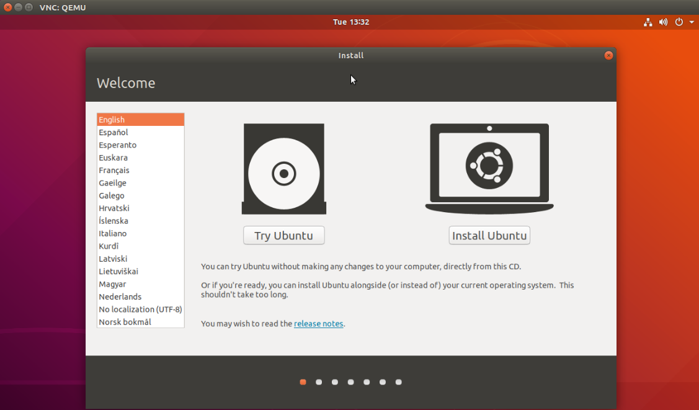

安装完毕后可以通过该命令启动

```bash
./qemu-system-x86_64 -m 12G -enable-kvm -smp 8 -cpu host ubuntu.img
```

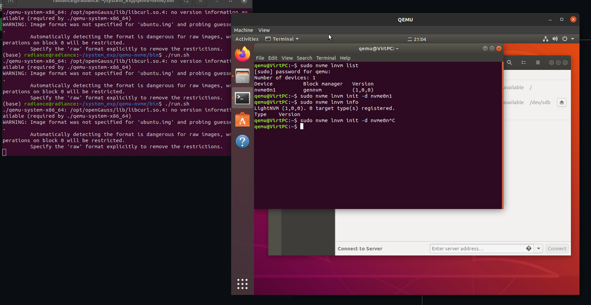

> 右图仅为打开qemu的例子，此时nvme还未安装

可以在虚拟机中安装一些需要的软件

```bash
sudo apt install git make gcc`
```

#### 4. 编译内核

从 OpenChannelSSD repository 中下载内核 **(do not use the Linux official )**.

```bash
git clone https://github.com/OpenChannelSSD/linux.git -b for-4.19/core
```

> **使用4.19版本的原因**
> Linux kernel support for Open-Channel SSDs is available in  version 4.4+ of the Linux kernel, pblk was added in 4.12, liblightnvm  support was added in 4.14, and finally the 2.0 specification support was added in 4.17.
> The open-channel SSD can either be accessed through lightnvm targets or liblightnvm.
>
> *4.17版本我启动不了，换成4.19可以了*

将`qemu-nvme/kernel.config` 拷贝到内核文件夹下（改名为`.config`）

```bash
cd linux
cp <qemu-nvme-repository-path>/kernel.config ./.config
```

确定`.config`中这些都设置为`y`
[](https://user-images.githubusercontent.com/40992472/61921883-a08d9080-af99-11e9-979d-095ef9f7812c.png)
编译内核

```bash
make -j
```

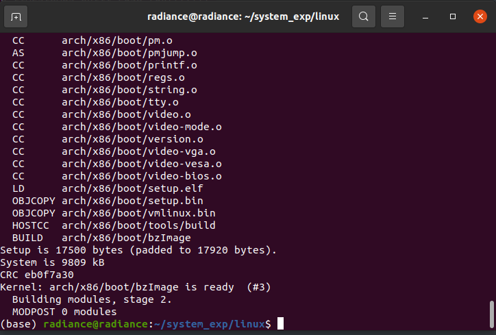

#### 5. 为虚拟机安装内核

使用 `qemu-img create`创建一块虚拟的40G外接盘

```bash
sudo dd if=/dev/zero of=/share.img bs=1M count=40000
sudo mkfs.ext4 /share.img

sudo mkdir /mnt/share
sudo mount -o loop /share.img /mnt/share
sudo cp -r /home/radiance/system_exp/linux-5.7.17 /mnt/share/
```

此时便可接入本虚拟盘启动qemu

```bash
./qemu-system-x86_64 -m 12G -enable-kvm -smp 8 -cpu host \
	ubuntu.img \
	-drive file=share.img,format=raw
```

在虚拟机上可以看到刚刚编译好的系统

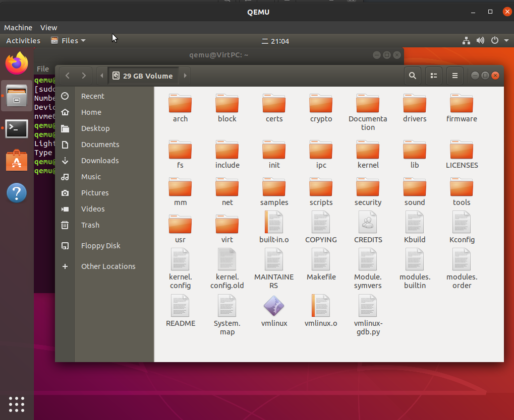

然后安装内核

```bash
sudo make modules_install install
```

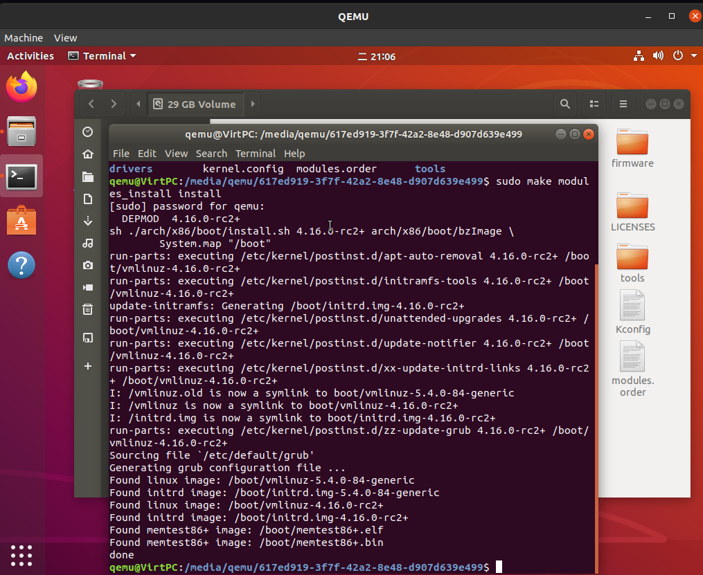

> *此处截图为安装4.17的内核，但安装之后启动不了虚拟机。于是之后换了4.19的内核*
>
> **如果启动不了怎么办？**以第3小节的方式虚拟光盘启动，根据此链接可修复启动，以原先的内核启动
>
> [https://askubuntu.com/questions/235362/trying-to-reinstall-grub-2-cannot-find-a-device-for-boot-is-dev-mounted]

重启电脑，并以新安装的内核启动（如果grub里不能选择启动内核，则另外i设置默认启动内核）

```bash
reboot
```

查看内核版本

```bash
uname -a
```


> ***此处为4.19的内核***

此时，实体机目录文件如下*（qemu*是复制过来的）

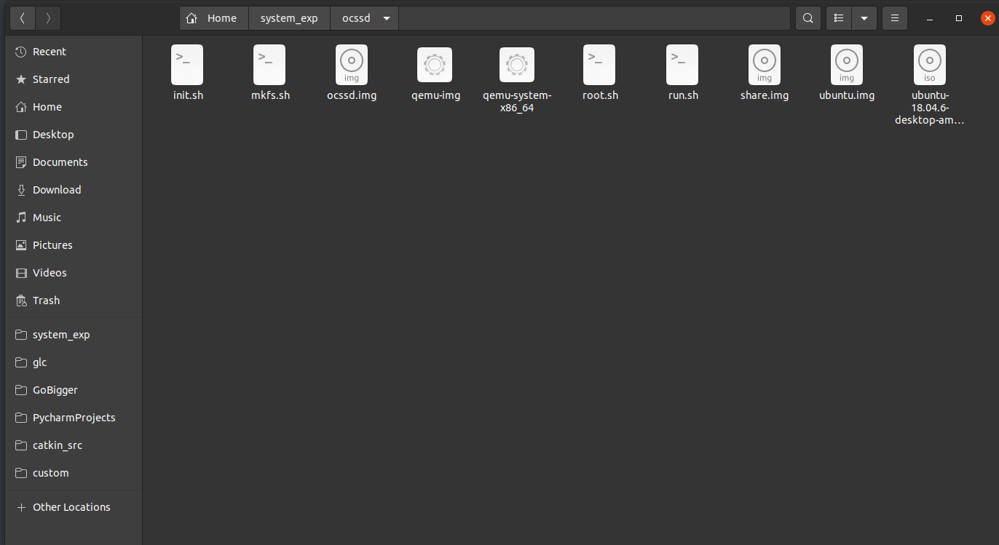

> 另一种使用编译好内核的方式：
>
> `./qemu-system-x86_64 -m 8192 -enable-kvm  ubuntu.img -blockdev  ocssd,node-name=nvme01,file.driver=file,file.filename=ocssd.img -device  nvme,drive=nvme01,serial=deadbeef,id=lnvm -vnc :2 -net  user,hostfwd=tcp::2222-:22 -net nic  -kernel  /home/kathy/linux/arch/x86_64/boot/bzImage -append root=/dev/sda1`

#### 6. 安装pblk

以该命令启动qemu，接入ocssd

```bash
./qemu-system-x86_64 -m 12G -enable-kvm -smp 8 -cpu host \
	ubuntu.img \
# -drive file=share.img,format=raw \
	-blockdev ocssd,node-name=nvme01,file.driver=file,file.filename=ocssd.img \
	-device nvme,drive=nvme01,serial=deadbeef,id=lnvm \
```

安装`nvme-cli`（可使用源代码安装，此处使用apt）

```bash
sudo apt install nvme-cli
```

`nvme-cli` 用来管理 nvme 设备。详情可参考 [https://github.com/linux-nvme/nvme-cli/blob/master/Documentation/nvme-lnvm-create.txt](https://github.com/kekeMemory/keke.github.io/issues/url)

```bash
sudo nvme lnvm list
```

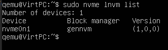

 **使用nvme-cli**

如果 block manager 返回 none (only pre-4.8 kernels) 则需初始化

```bash
sudo nvme lnvm init -d nvme0n1
```

安装pblk

```bash
sudo nvme lnvm create -d nvme0n1 --lun-begin=0 --lun-end=3 -n mydevice -t pblk
sudo nvme lnvm info
```

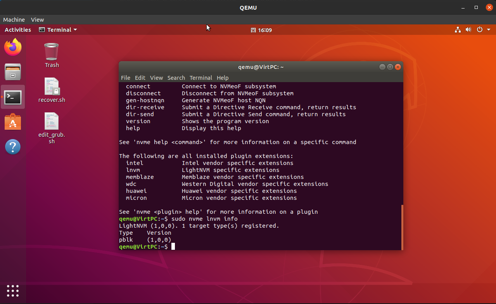

可以看到，pblk安装成功

#### 7. 进一步开发

配置vscode连接虚拟机进行开发

为虚拟机安装openssh

```bash
sudo apt-get install openssh-server
```

启动ssh服务

```bash
sudo /etc/init.d/ssh start
```

```bash
./qemu-system-x86_64 -m 12G -enable-kvm -smp 8 -cpu host \
	ubuntu.img \
# -drive file=share.img,format=raw \
	-blockdev ocssd,node-name=nvme01,file.driver=file,file.filename=ocssd.img \
	-device nvme,drive=nvme01,serial=deadbeef,id=lnvm \
	-net user,hostfwd=tcp::2223-:22   -net nic
```

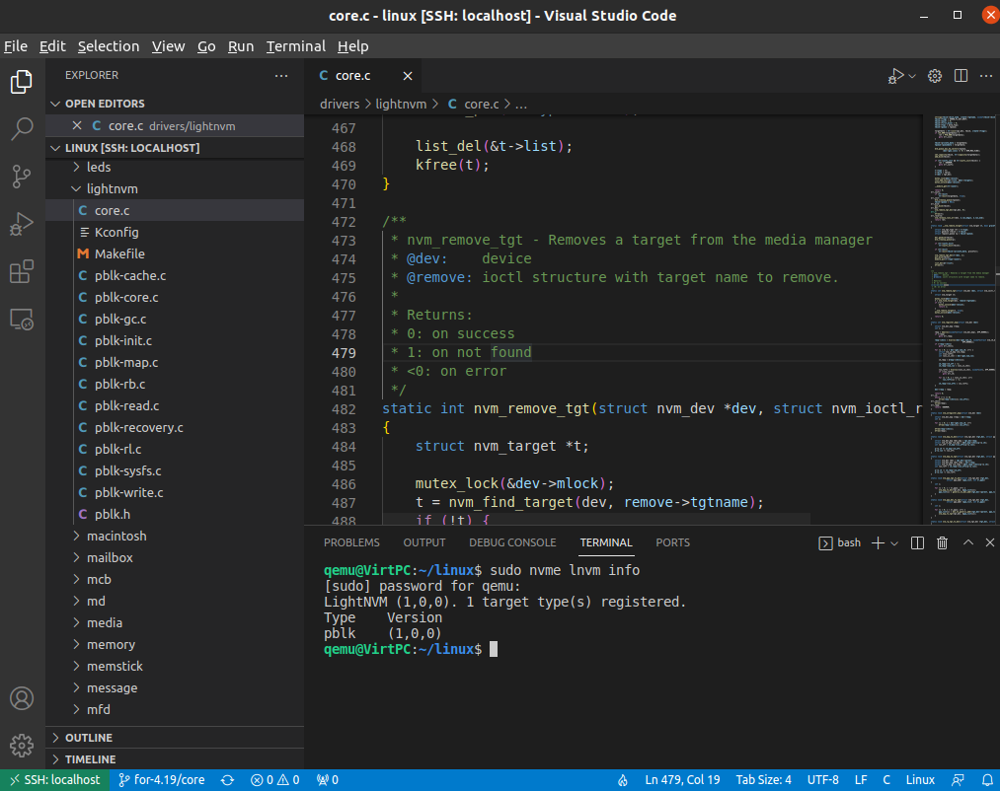

### 实验结果

利用 QEMU-NVME 模拟了一个 Open channel SSD，为其成功安装PBLK

------

## 实验环境

实体机：Ubuntu20.04

busybox-1.32.1

crosstool-ng-1.25.0

linux5.7.7

OCSSD虚拟机：Ubuntu18.04

OCSSD中虚拟机安装的内核： Linux 4.19 from [https://github.com/OpenChannelSSD/linux.git]

参考：

https://openchannelssd.readthedocs.io/

http://lightnvm.io/liblightnvm/quick_start/index.html

https://github.com/kekeMemory/keke.github.io/issues/1

